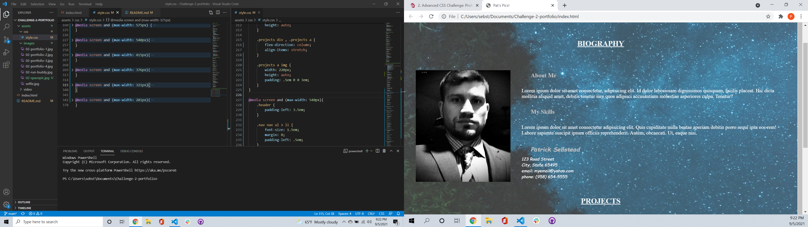
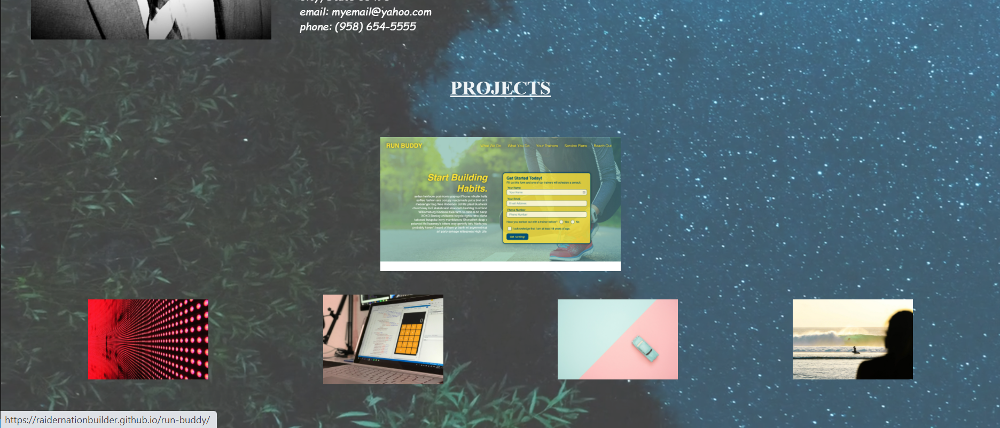

# Challenge-2-portfolio

Discription:
The project scope is to create a profile of my career in web development thus far. I needed a contact, a biographical, and a completed works section. All of these sections needed clickable links that either navigate to the proper url or the appropriate section of the profile page. Additional requirements are the first project needed to be larger on the screen than the other projects; the page needs to be responsive to resizing of the viewport. 

Screenshots :

link to git url:
https://raidernationbuilder.github.io/Challenge-2-portfolio/